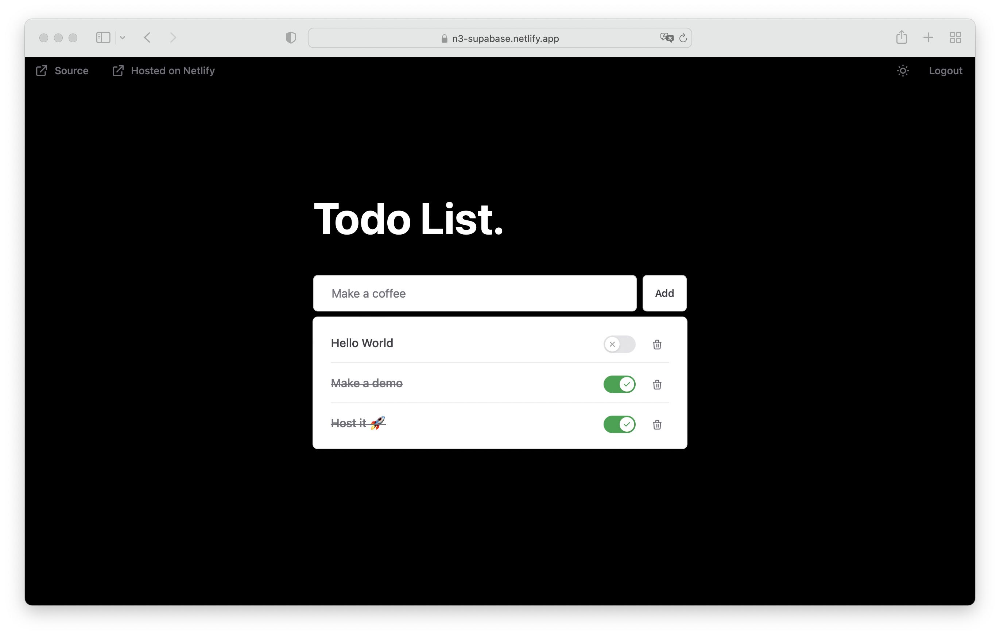

# The same app, with different frameworks

From the [supabase nuxt module example](https://github.com/nuxt-modules/supabase/tree/main/demo)

### Shared functionalities:

- Atomic CSS frameworks

- Typescript

## Vue

- Vue 3, Vite

- Auto importing

## React

- React 18

## Svelte

- Svelte 3, Vite

## Angular

- Angular 14

